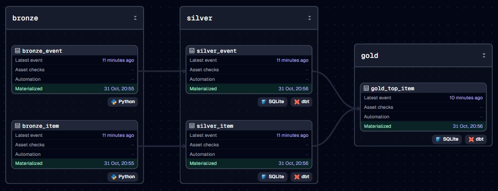

# dagster-dbt-medallion

This project demonstrates a full, local ELT pipeline that:
1.  **Extracts & Loads** data into a SQLite database (`medallion.db`). The default setup uses local CSVs, with an option to switch to a public S3 bucket.
2.  **Transforms** the data using **dbt** to create a Bronze, Silver, and Gold medallion architecture.
3.  **Orchestrates** the entire pipeline using **Dagster**.

---

## Pipeline Overview

When you run the project in Dagster, the full dependency graph (DAG) will look like this, showing the three distinct asset groups: **bronze** (Python-based EL), **silver** (dbt), and **gold** (dbt).



---

## How to Run

### 1. Prerequisites

* **Python** (3.8 - 3.11)
* **Git**

### 2. Global Setup (Recommended)

To avoid setting the `DAGSTER_HOME` variable every time you run the pipeline, you can set it as a global environment variable for your Windows user.

1.  Press the **Windows key** and type "Edit the system environment variables."
2.  In the window that appears, click the "**Environment Variables...**" button.
3.  In the top box ("User variables"), click "**New...**".
4.  Enter the following:
    * **Variable name:** `DAGSTER_HOME`
    * **Variable value:** `C:\path\to\your\dagster-dbt-medallion\dagster_home` (e.g., `C:\Users\alex\DEV_PY\DBT\dagster_home`)
5.  Click **OK** on all windows to save.
6.  **Important:** You must **close and reopen** any open terminal windows for this change to take effect.

### 3. Project Setup

1.  **Clone the Repository:**
    ```bash
    git clone https://github.com/alp78/dagster-dbt-medallion.git
    cd dagster-dbt-medallion
    ```

2.  **Create and Activate Virtual Environment:**
    ```bash
    # On Windows
    python -m venv .dag
    .dag\Scripts\activate
    ```

3.  **Install Dependencies:**
    ```bash
    pip install -r requirements.txt
    ```

### 4. dbt Profile Setup

This project requires a `profiles.yml` file to be present in your user's `.dbt` folder.

1.  Find or create your `.dbt` folder.
    * On Windows: `C:\Users\<YourName>\.dbt\`
2.  Create a file named `profiles.yml` inside it.
3.  Paste the following content. The relative paths (`../`) will work correctly as long as your dbt project (`local_medallion`) is in the same folder as your database file (`medallion.db`).

    ```yaml
    local_medallion:
      target: dev
      outputs:
        dev:
          type: sqlite
          threads: 1
          database: 'medallion' # Logical name
          schema: 'main'
          schema_directory: '../' # Points to the parent (DBT) folder
          schemas_and_paths:
            main: '../medallion.db' # Path to the DB file
    ```

### 5. Run the Pipeline

1.  **Compile dbt:**
    This generates the `manifest.json` file that Dagster needs to read. (You only need to do this once, or after changing your dbt models).
    ```bash
    dbt compile --project-dir local_medallion
    ```

2.  **Create Dagster Home Folder:**
    (If you did not set the global environment variable, this folder must be created in the location you will point to).
    ```bash
    mkdir dagster_home
    ```

3.  **Run Terminal 1 (Webserver):**
    Open a terminal, activate your virtual environment, and run:
    ```powershell
    # If you did *not* set the global variable, run this line first:
    # $env:DAGSTER_HOME = ".\dagster_home"
    
    # Run the webserver and daemon
    dagster dev
    ```

4.  Open `http://127.0.0.1:3000` in your browser, go to Overview, click on **"Materialize an asset"** and then **"Materialize all"**. The pipeline will run, creating the `medallion.db` file.

---

### Optional: Switch to S3 Data Source

By default, this pipeline reads from the local `/sources` folder. To switch it to the public S3 bucket:

1.  Open the `medallion_pipeline.py` file.
2.  **Comment out** the `LOCAL_SOURCES_DIR` variable.
3.  **Uncomment** the `BUCKET_NAME`, `ITEM_KEY`, and `EVENT_KEY` variables.
4.  In the `bronze_item` asset:
    * **Comment out** the "New Local Logic" block.
    * **Uncomment** the "S3 Logic (Commented out)" block.
5.  In the `bronze_event` asset:
    * **Comment out** the "New Local Logic" block.
    * **Uncomment** the "S3 Logic (Commented out)" block.

### Optional: Explore the Data

Once the pipeline has run, you can explore the database using the included Jupyter notebook.

1.  In your terminal (with the `.dag` active), run:
    ```bash
    jupyter notebook 
    ```
2.  Your browser will open the JupyterLab interface.
3.  On the left-hand side, double-click `MedallionDataExplorer.ipynb`.
4.  Run the cells in the notebook to see visualizations and analyses of the tables in your `medallion.db` file.
